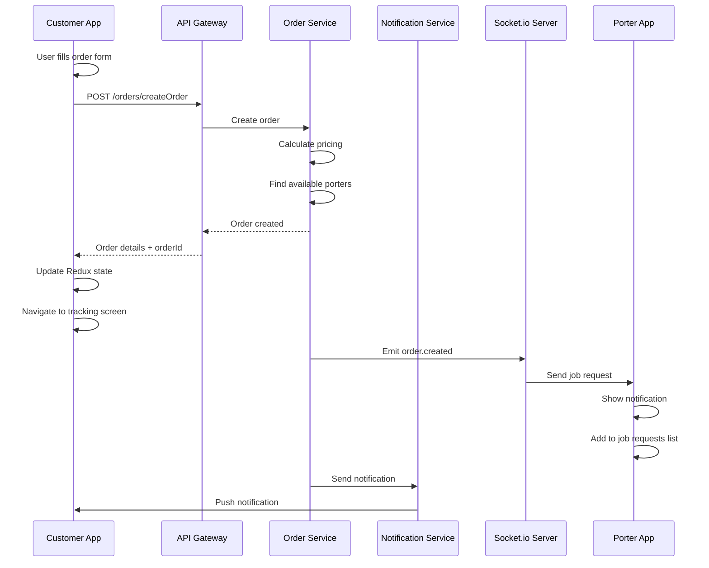
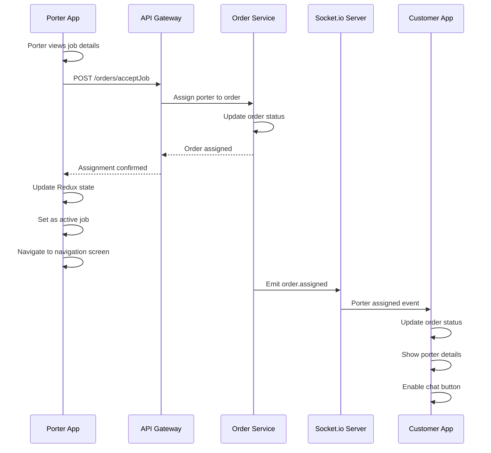
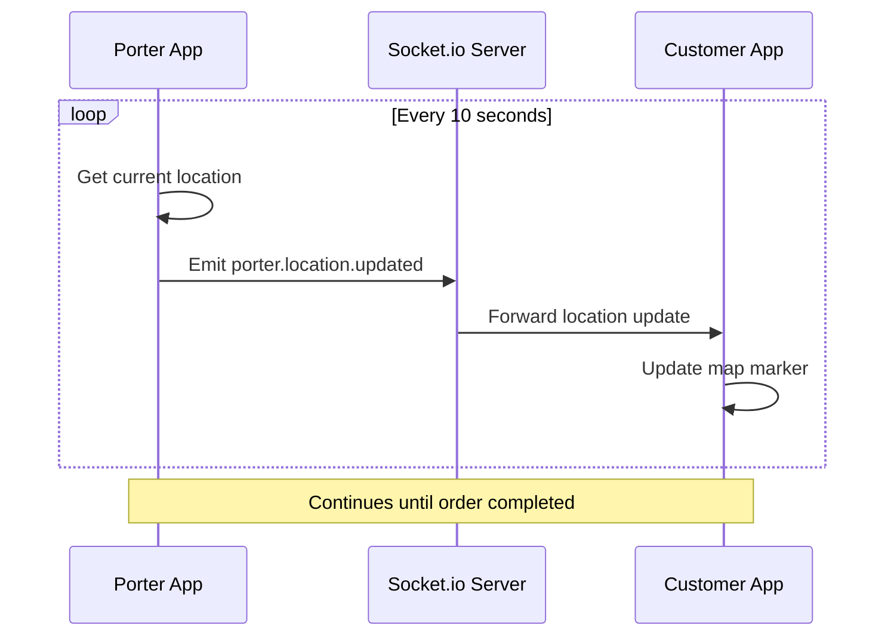
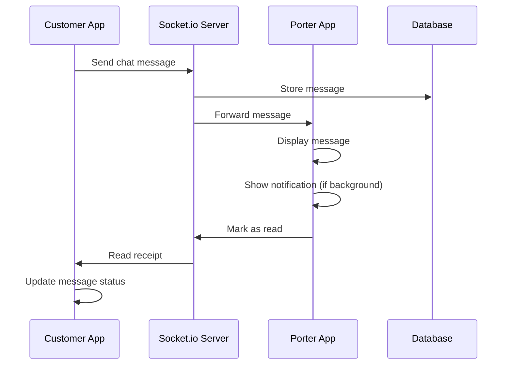
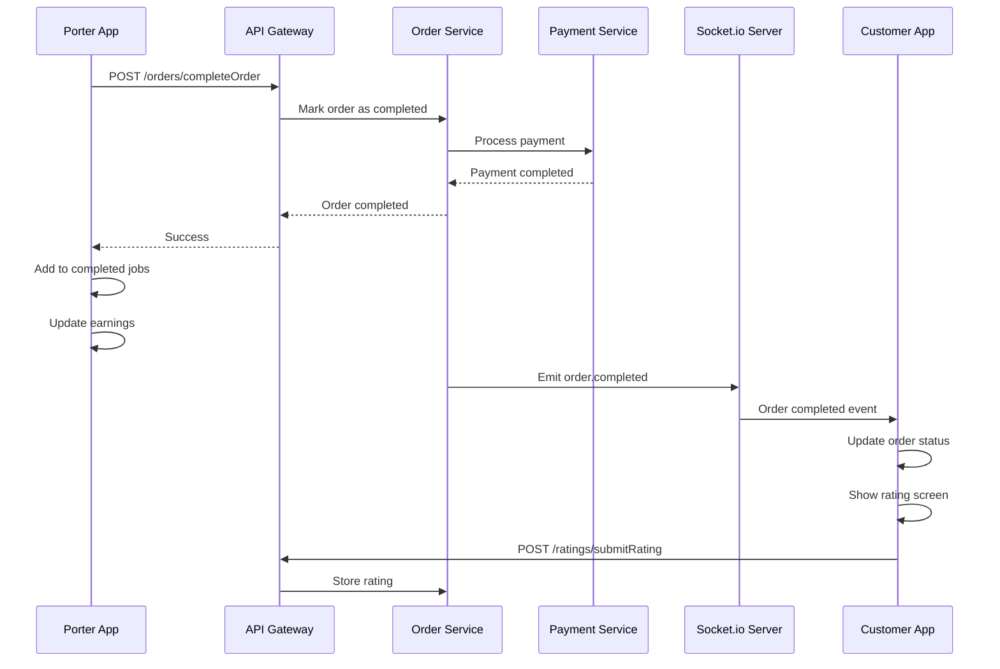
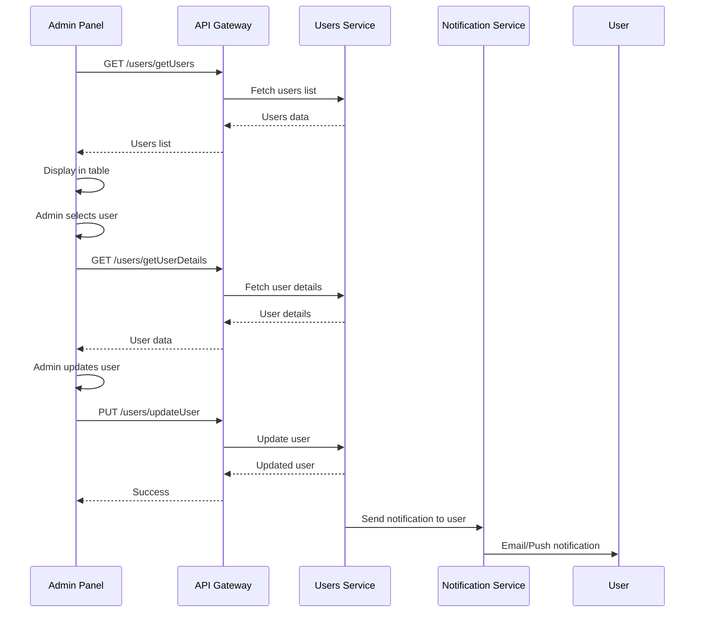
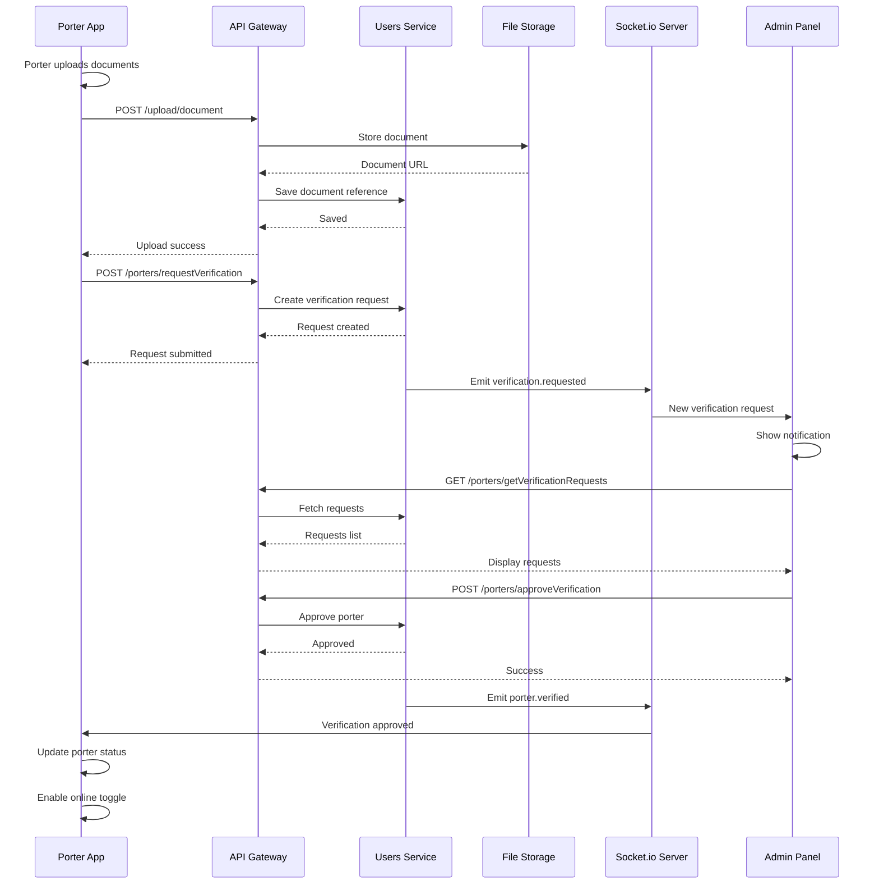
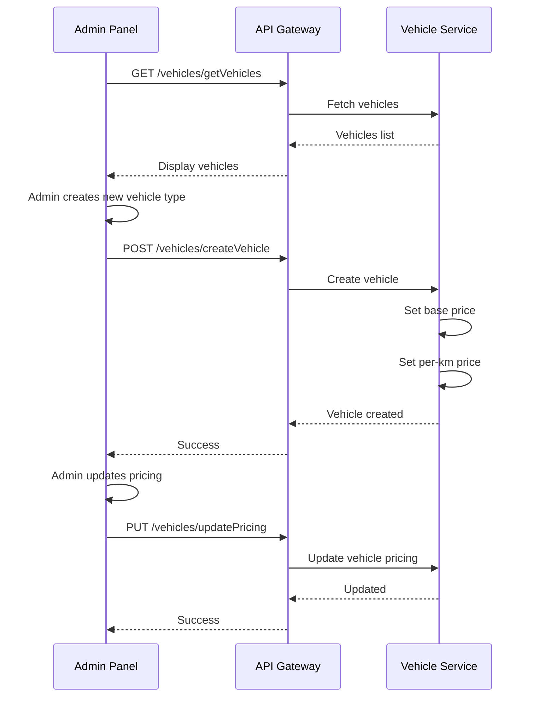
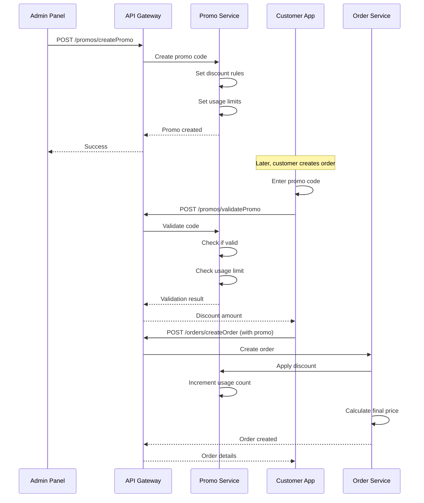
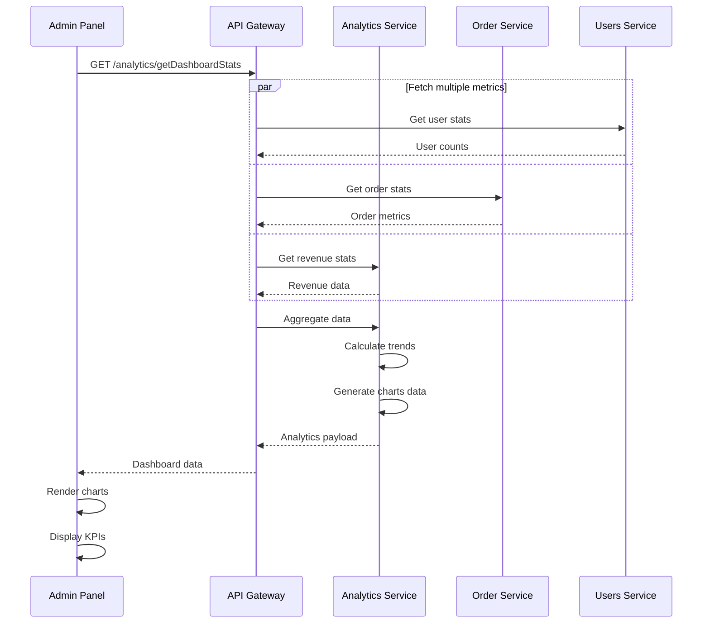

# MoveNow Frontend Sequence Diagrams

## 1. Order Creation Flow (Customer App)

## 2. Porter Job Acceptance Flow

## 3. Real-time Location Tracking

## 4. In-app Chat Flow

## 5. Order Completion & Rating

## 6. Admin User Management Flow

## 7. Porter Verification Flow

## 8. Vehicle & Pricing Management

## 9. Promo Code Creation & Usage

## 10. Analytics Data Flow

